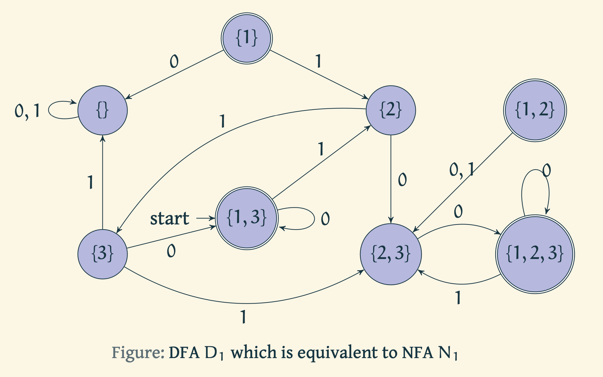

### Prerequisites

1. [Language acceptance by Deterministic Finite Automata (DFAs)](https://virtual-labs.github.io/exp-determinstic-finite-automaton-iiith/)
2. [Language acceptance by Non-deterministic Finite Automata (NFAs)](https://virtual-labs.github.io/exp-non-determinstic-finite-automaton-iiith/)

# Introduction

Assuming that the reader has the understanding of DFAs and NFAs, we pose the following question to them.

> Are there languages that are accepted by NFAs but not by DFAs?

Another way to think about this question is the following.

> Are there languages that truly use the power of non-determinism.

As it turns out, the answer to the questions above is **no**. This is extremely surprising to understand that non-determinism does not add much power to the finite automata with respect to computability.

We shall now show that given any non-deterministic finite automaton that accepts a language $ L $, we can construct a deterministic automaton that also accepts $ L $. Recall that when we defined NFAs, we spoke of multiple possibilities of transition from the current state upon reading a letter of the input, and $ \varepsilon $ transitions. These gave the finite state machines the power of non-determinism. In particular, we said that the machine splits into multiple copies when it encounters a situation of multiple transition possibilities. 

> How does one encode the notion of "multiple copies of a finite state machine running in parallel"?

One way to encode this is through the power-set construction. Let us illustrate that using an example.

Now let us stare at the transition table of this NFA $ N_1 = (Q = \{q_1, q_2, q_3\}, \Sigma = \{0,1\}, \delta, q_1, \{q_1\}) $ and try to construct a DFA $ D_1 = (Q', \Sigma, \delta', S, F) $ that accepts the same language as $ N_1 $.

|       | $ 0 $            | $ 1 $   | $ \varepsilon $ |
|:------|:--------------:|:-----:|--------------:|
| $ q_1 $ |                | $ q_2 $ |         $ q_3 $ |
| $ q_2 $ | $ \{q_2, q_3\} $ | $ q_3 $ |               |
| $ q_3 $ | $ q_1 $          |       |               |

<!-- 
Now let us rewrite this transition table as follows.

|           | $0$            | $1$       | $\varepsilon$ |
|:----------|:--------------:|:---------:|--------------:|
| $\{q_1\}$ |                | $\{q_2\}$ |     $\{q_3\}$ |
| $\{q_2\}$ | $\{q_2, q_3\}$ | $\{q_3\}$ |               |
| $\{q_3\}$ | $\{q_1\}$      |           |               |
--->

Note that we need to keep track of the transitions across multiple copies of the machine, deterministically. Towards this the following idea could work.

> Can we create a new finite state automaton whose states are labeled by subsets of $ \{q_1, q_2, q_3\} $.

Let $Q'$ denote the power-set of $ \{q_1, q_2, q_3\} $. Let $ \Sigma' $ be the same as $ \Sigma = \{0,1\} $. Now we shall the define the transitions as follows.

For a subset $ R $ of $ \{q_1, q_2, q_3\} $ and a letter $ a $ of the alphabet, we could possibly define the transition function $ \delta' $ as follows. 

$$ \delta'(R,a) = \{q \in Q \mid q\in \cup_{r\in R}\delta(r,a) \}. $$

For example, $ \delta'(\{q_2\}, 0) = \{q_2, q_3\}$, $\delta'(\{q_1\}, 0) = \emptyset $, and so on. But this does not take care of $ \varepsilon $-transitions. Recall that $ \varepsilon $-transitions create copies of the machine without reading a letter of the input. For any subset $ R $, let $ E(R) $ be defined as follows.

 $ E(R) = \{ R\cup $ states $ q $ that are reachable from some $ r\in R $ via one or more $ \varepsilon $ transitions$ \} $. 

Thus, we modify the above definition of $ \delta'(R,a) $ as follows.

\[ \delta'(R,a) = \{q \in Q \mid q\in \cup_{r\in R}E(\delta(r,a)) \}. \]

Now the start state of the machine $ D_1 $ is the set of all the states that are reachable from $ q_1 $ (the start state of $ N_1 $) via $ \varepsilon $ transitions. That is, $ E({q_1}) $. Final states $ F' $ of the machine $ D_1 $ are going to be the set of states in $ Q' $ that contain an accepting state of $ N_1 $.

We show this pictorially as follows.

We can also remove the states $ \{1\} $ and $ \{1,2\} $ as they do not have any incoming edges to simplify the DFA.

> Is power-set construction the only way to construct a DFA given an NFA?

No, there are more conversion algorithms. [Kleene's algorithm](https://en.wikipedia.org/wiki/Kleene%27s_algorithm) is yet another way to convert a NFA into a DFA.

> Given a NFA over $k$ states, the DFA constructed through the power-set construction could have $2^k$ many states.

*Things to ponder:*
1. Given a NFA over $ k $ states, can we construct a DFA with much fewer states than $ 2^k $.
2. Are there any languages for which there is a NFA with *few* states and for every equivalent DFA has a *lot* of states.

## Related topics
1. [Language acceptance by Deterministic Finite Automata](https://virtual-labs.github.io/exp-determinstic-finite-automaton-iiith/)
2. [Language acceptance by Non-Deterministic Finite Automata](https://virtual-labs.github.io/exp-non-determinstic-finite-automaton-iiith/)
3. [Converting a Regular Expression to NFA](https://virtual-labs.github.io/exp-converting-regular-expression-iiith/)

