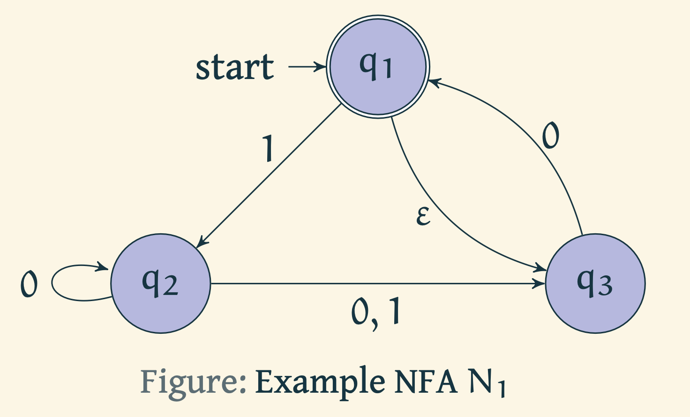

### Prerequisites

1. [Language acceptance by Deterministic Finite Automata (DFAs)](https://virtual-labs.github.io/exp-determinstic-finite-automaton-iiith/)
2. [Language acceptance by Non-deterministic Finite Automata (NFAs)](https://virtual-labs.github.io/exp-non-determinstic-finite-automaton-iiith/)

# Introduction

Assuming that the reader has the understanding of DFAs and NFAs, we pose the following question to them.

> Are there languages that are accepted by NFAs but not by DFAs?

Another way to think about this question is the following.

> Are there languages that truly use the power of non-determinism.

As it turns out, the answer to the questions above is **no**. This is extremely surprising to understand that non-determinism does not add much power to the finite automata with respect to computability.

We shall now show that given any non-deterministic finite automaton that accepts a language $L$, we can construct a deterministic automaton that also accepts $L$. Recall that when we defined NFAs, we spoke of multiple possibilities of transition from the current state upon reading a letter of the input, and $\varepsilon$ transitions. These gave the finite state machines the power of non-determinism. In particular, we said that the machine splits into multiple copies when it encounters a situation of multiple transition possibilities. 

> How does one encode the notion of "multiple copies of a finite state machine running in parallel"?

One way to encode this is through the powerset construction. Let us illustrate that using an example.

